# CopyWrite AI: System Design (MVP)

**Course:** Generative AI (Final Year B.Tech IT, Sem I, 2026-27): Mini Project
**One line:** Type (or upload) your notes and a photo of a few lines of your handwriting, and get back ruled-notebook pages written in *your* handwriting, as PNG/PDF.

---

## 1. Constraints that shaped every decision

| Constraint | Consequence |
|---|---|
| **Days, not weeks** | No model training. Use a **pretrained zero-shot model** and spend the time on the pipeline, layout and evaluation. |
| **Weak laptop (no usable GPU)** | Heavy model runs on a **free cloud GPU** (Colab/Kaggle T4). The laptop only does coding, the light parts, and a browser. |
| **Must be on GitHub** | Everything is code + a notebook; personal handwriting photos are git-ignored. |
| **Graded on methodology, implementation + results, presentation** | Pick a model that maps cleanly onto the syllabus, and build a proper **baseline comparison + metrics**. |
| **No manual typing of the sample** | Handwriting **OCR (TrOCR)** reads the style photo and flags lines it is unsure of; the user only fixes mistakes. |
| **Must be easy to demo** | A built-in **library of 36 real handwritings** (IAM database) means the app works with zero setup: pick a style, paste notes, click one button. |
| **Ethics not required in MVP** | Watermark is an **optional toggle** (off by default). A short ethics reflection is still needed for the *Reflective Journal*, not for the build. |

## 2. The key decision: which model

**Chosen: Emuru** (Pippi et al., *"Zero-Shot Styled Text Image Generation, but Make It Autoregressive"*, CVPR 2025). MIT license, weights on Hugging Face (`blowing-up-groundhogs/emuru`, 0.7 B params, ~2.9 GB).

Why it fits:
- **Zero-shot / few-shot:** it imitates a handwriting it has never seen from **one line image + its transcription**. No fine-tuning needed, which is what makes the timeline possible.
- **Writes whole lines of any length**, not single words, so the layout engine only has to stack lines.
- **Clean output (ink on white, no background artifacts)**, which composites neatly onto any page.
- **Syllabus fit is excellent:**
  - **Module 2:** a **Variational Autoencoder** (convolutional VAE) compresses text images into latents.
  - **Module 3:** a **T5 Transformer** (encoder-decoder, attention) autoregressively predicts the next image latent, conditioned on text and style, just like GPT predicts the next token.
  - **Module 2 evaluation:** FID / KID.
  - **Module 3 (Vision Transformer):** TrOCR (ViT encoder + Transformer decoder) reads the user's handwriting sample, so no typing is needed.

**How it works (for the report):**
1. The style image (64 px tall) is encoded by the VAE into a sequence of latent "columns", one every 8 px of width.
2. The T5 encoder reads the text: `"<style transcription> <text to write>"`.
3. The T5 decoder is fed the style latents as a prompt and then **continues the sequence**, predicting latent columns for the new text one at a time. Because it is continuing the style image, the new text comes out in the same handwriting.
4. Generation stops when the model predicts "padding" (blank) latents. The VAE decoder turns the latents back into pixels.

Note: generation is **not deterministic**. The style image is encoded by *sampling* the VAE's latent distribution, so the same (style, text) gives slightly different lines for different seeds. The pipeline fixes the seed for reproducibility.

**What the style image must look like.** From the model card and `modeling_emuru.py`: RGB, **64 px tall** (aspect kept), `to_tensor` then `normalize(0.5, 0.5)` to [-1, 1]. `style_text + " " + gen_text` is fed to T5, and only the new part of the canvas is returned. The official `sample.png` (and the synthetic training data) is **pure black ink on pure white paper** with a small margin. So `preprocess.py` makes every style line match: illumination flattening, ruling removal, **removal of strokes that leak in from the lines above/below** (connected components outside the line's core band), tight crop, 64 px resize, then **contrast normalisation** (paper → 255, ink → ~0). Before this step, real photos gave light-grey paper and grey ink (~50-70), which the model never saw in training.

**Plan B (if Emuru misbehaves):** VATr / VATr++ (same research group, GAN + Transformer, word-level, much lighter, also on Hugging Face). Only the backend class would change.

**Baseline:** a handwriting *font* with random per-letter jitter (`FontGenerator`). This is exactly the "static digital font" the problem statement criticises, so beating it is the result you show.

## 3. Where it runs

```
┌──────────── Your laptop ────────────┐          ┌──────── Google Colab / Kaggle (free T4 GPU) ───────┐
│ VS Code: write & test code           │  git     │ notebook: clone repo → pip install → serve.py       │
│ python app.py --backend font         │ ───────► │  Emuru model on GPU (~3 GB VRAM)                    │
│   (whole UI + layout, no AI, instant)│  push    │  Gradio app + layout engine                          │
│ Browser ─────────────────────────────┼─────────►│  public https://xxxx.trycloudflare.com link          │
└──────────────────────────────────────┘  link    └──────────────────────────────────────────────────────┘
```

| Mode | Where | Use it for |
|---|---|---|
| **Font backend, local** | Laptop | Building/debugging the UI, layout, backgrounds, PDF. Needs no torch. `python app.py` picks it automatically when there is no GPU. |
| **Emuru on Colab/Kaggle** | Cloud GPU | Real results, demo, evaluation. Open the public link from the laptop or from a phone during the viva. Kaggle (30 GPU h/week) when Colab's daily GPU quota is used up. |
| **Emuru on CPU** | Laptop, if it has ≥ 8 GB free RAM | Possible but slow (minutes per page). Only as a last resort. |

**Hosting the link.** `serve.py` starts `app.py` in the background, waits until it really answers on localhost (and prints the crash log if it doesn't), then opens a free **Cloudflare quick tunnel** (`*.trycloudflare.com`, no account) and prints the link only once it loads. On Colab it also prints a Colab-proxied backup link. We moved away from Gradio's own `gradio.live` share link because its relay returned **504 Gateway Time-out** in our runs, and the old notebook cell gave no way to tell a dead app from a dead relay. The launcher lives in the repo rather than in the notebook, so a `git pull` updates it. Tested end to end through the tunnel (sample list, generation, PDF download).

Demo-day tip: start the Colab session ~10 min before, keep a **pre-generated PDF + screenshots** as a fallback in case the link or Wi-Fi fails.

## 4. Architecture

```mermaid
flowchart LR
    A[Text box / .txt / .docx] --> P
    S[Photo of 2-5 handwritten lines] --> PRE[Style preprocessing<br/>light flattening · ruling removal ·<br/>line split · neighbour-stroke removal ·<br/>crop · contrast normalisation]
    PRE --> OCR[TrOCR reads each line<br/>+ confidence]
    OCR --> FIX[User checks / corrects text]
    FIX --> REF[Style references<br/>64px image + exact text]
    L[Sample library<br/>IAM lines + transcriptions] --> REF
    REF --> P[Pipeline]
    B[Background: ruled / plain / grid<br/>or photo of a page] --> BG[Background module<br/>ruled-line detection · margin detection]
    BG --> P
    P --> CAL[Width model: px per char<br/>measured on the style line]
    CAL --> WRAP[Word wrap to page width]
    WRAP --> SPLIT[Split lines into pieces<br/>of a few words]
    SPLIT --> GEN[Emuru, batched on GPU]
    GEN --> CHK{Check each piece<br/>width + TrOCR read-back}
    CHK -- fail --> RETRY[Retry: new seed,<br/>then split into words]
    RETRY --> GEN
    CHK -- pass --> STITCH[Stitch pieces with the<br/>handwriting's word spacing]
    STITCH --> LAY[Layout engine<br/>scale · baseline align · jitter]
    LAY --> COMP[Ink compositing<br/>multiply blend, ink colour]
    COMP --> WM{Watermark?<br/>optional}
    WM --> OUT[PNG pages + PDF]
```



### Code map

| File | Responsibility |
|---|---|
| `copywrite/preprocess.py` | Phone photo → clean style lines: illumination flattening, notebook-line removal, projection-profile line split, neighbour-stroke removal, crop, 64 px resize, contrast normalisation, safe shortening of long lines |
| `copywrite/library.py` | Sample handwritings: downloads one IAM split from Hugging Face (`Teklia/IAM-line`, ~24 MB, once), picks 36 clean lines spread across writers, and caches them as style references |
| `copywrite/ocr.py` | TrOCR handwriting OCR: reads the style lines with a confidence score (auto-transcription); checks every generated piece; reused for the legibility metric |
| `copywrite/backends.py` | `EmuruGenerator` (AI), `FontGenerator` (baseline). Same interface: `generate_many(texts, style) → images`, one raw model call. Emuru: relaxed stopping rule, out-of-memory recovery (halve the batch), per-item fallback, errors recorded |
| `copywrite/writer.py` | `LineWriter`: the reliability layer. Pieces → batched generation → verification → retries → stitching (Section 4.1) |
| `copywrite/metrics.py` | CER and letter-level CER (shared by the verifier and the evaluation) |
| `copywrite/background.py` | Page templates; ruled-line and margin detection on photos (morphology + peak finding); line slots |
| `copywrite/layout.py` | Word wrap, baseline estimation, ink normalisation + pen thickness, scaling/overflow handling, jitter, multiply-blend compositing |
| `copywrite/pipeline.py` | Orchestration: background → width model → wrap → LineWriter → pages; returns stats (pieces, rewritten, unverified, timing); optional debug folder |
| `copywrite/watermark.py` | Optional invisible DWT-DCT watermark (embed + detect) |
| `serve.py` | Launcher: background app + health check + Cloudflare public link + status/stop |
| `copywrite/cli.py`, `app.py` | Command line and Gradio UI. The UI has three steps (choose handwriting → text → page) plus one button, with advanced settings folded away; it picks the engine from GPU availability and preloads the model and library in the background. Works on Gradio 5 and 6. |
| `scripts/evaluate.py` | CER (TrOCR), KID/FID, speed, comparison sheet |
| `notebooks/run_on_colab.ipynb` | One-click GPU run |

### 4.0 Ink rendering (why the first pages looked faded)

Emuru's VAE decoder draws strokes in **dark grey, not black**, with a faint haze around them. The old layout pasted that grey as-is, then shrank the thin strokes with Lanczos resampling, then cut off the faintest 8%, so the pages looked washed out. Now each line goes through `layout.ink_alpha` at the model's own resolution, before any resizing:
1. **Per-line contrast stretch:** the paper/haze level maps to 0 and the strong strokes (90th percentile of stroke pixels) map to full ink. Grey strokes become solid, and lines that are already black barely change.
2. **Pen thickness** (0-2): each unit is one 3×3 dilation at 64 px height, blended for fractions. 0 = as generated, 1 = ballpoint, 2 = gel pen.
3. **Soft edges:** a gamma of 0.8 gives solid stroke cores with anti-aliased edges.
4. **Resizing:** the ink map (not the grey image) is resized with area averaging, which keeps thin strokes' coverage, and rotated with an expanding warp.

Pages are now rendered at **200 DPI** (was 150) for crisper strokes, and the ink opacity went from 0.92 to 0.97. This was tested by feeding real handwriting faded to grey (~55% strength) plus haze through the old and new code: the old pages were pale and the new ones show solid pen strokes.

### 4.1 Reliable generation (LineWriter)

**The problem (first GPU run).** Whole lines were sent to Emuru in one call, and about half the text never appeared. The causes were in how the model decides to stop:
- Emuru writes one 8-px latent column at a time and stops when `stopping_after` (default **10**) columns in a row look like blank paper, i.e. ~80 px of white. At 64 px line height, a wide word gap is about that size, so with loosely spaced handwriting it **stopped mid-line**.
- Each call held ~40 characters of style text plus a ~60-character line. The longer the text, the more likely an early stop or a run-on.
- Nothing checked the result, so a truncated line went straight onto the page.
- The width calibration was itself a generated sentence, so if that got truncated, the wrap width was wrong too.

**The design.** Never trust a single model call with a whole line:

| Stage | What | Why |
|---|---|---|
| Width model | px per character measured on the style line itself | Emuru writes about as wide as the style; no model call that could fail |
| Split | Each line → pieces of whole words, ≤ 28 characters (~4-5 words) | Short text is far more reliable, and similar-length pieces batch well |
| Generate | All pieces batched per style line; `stopping_after = 16` (~128 px of white) | A word gap no longer ends the line; batches make it fast on a T4 |
| Verify | (a) **Width:** ink width / (characters × px-per-char) must be 0.7-1.9. (b) **TrOCR read-back:** letter-level CER ≤ 0.25. (c) **Missing letters:** letters of the text with no match in the read-back (alignment deletions) - none allowed under 20 letters, 5% above. (d) **Run-on:** no more than ~15% extra letters | Catches truncation, blank output, scribbling past the end, wrong words, and dropped words or letters |
| Retry | Failed pieces get 2 new attempts with new seeds per round (3 rounds in Fast, 4 in Best); in the last round a stubborn multi-word piece is split into halves. The best-scoring attempt is always kept | Emuru samples its style latents, so a new seed gives a genuinely different attempt |
| Best-of-N | "Best" quality: 3 attempts per piece on the first pass, keep the one OCR reads best | Higher fidelity when time allows |
| Stitch | Pieces joined side by side, gap = the style's median word gap; baseline from the line (or the style line for short text) | Emuru continues the style image, so every piece shares the style's baseline and spacing |
| Fallback | If the model wrote nothing even after retries, the piece is drawn with a plain font at the handwriting's width, and this is reported | **No text is ever silently dropped** |

**Why the missing-letter check (second GPU run).** Users still saw skipped letters and words. The CER limit was the leak: a 4-word piece missing a whole word reads at only ~0.24 CER, under the old 0.4 limit, so it passed. Now dropped letters are counted directly from the alignment between the read-back and the text, the CER limit is 0.25 and the width floor 0.7. On a simulated model that drops a word in 25% of pieces and 1-2 letters in another 25%, damaged pieces left in the output fell from 22 to 6 of 63 (Fast) and 3 to 2 (Best), and no dropped word survived. Limit: TrOCR has a language prior and can "read" a common word correctly even when a letter is missing, so such a slip cannot always be detected; "Best" quality reduces it by choosing among three attempts.

Other robustness details:
- **Typography:** Word/.docx characters (curly quotes, en/em dashes, ellipsis, bullets) are converted to plain ones. The model reads raw UTF-8 bytes (ByT5 tokenizer), and a curly quote is 3 bytes it never saw.
- **GPU memory:** out-of-memory halves the batch. Any other model error falls back to one-by-one generation, so one bad item can't lose a batch. The error is kept and shown to the user.
- **Reporting:** every run reports pieces, rewritten, split, unverified and font fallbacks.
- **Debug mode:** the UI checkbox or `--debug-dir` saves the style line, every attempt (marked ok/bad), each stitched line, the pages, and `pieces.csv` (OCR read, CER, width ratio per piece).

This was tested locally with a simulated unreliable generator that truncates 30-45% of pieces, returns nothing for 10% and runs on for 10%:
- **Fast:** 1-3 of ~25 pieces stayed unverified.
- **Best:** 0-2 stayed unverified.
- **Model that returns nothing:** the page is still complete, via the font fallback.
- **Perfect generator:** 0 retries.

The OCR check only runs with the AI engine and needs TrOCR (~1.3 GB, loaded next to Emuru on the T4). Evaluation (`scripts/evaluate.py`) uses the same LineWriter **without** the OCR check, because TrOCR is also the legibility metric and letting it choose the outputs would inflate the score.

## 5. Inputs and outputs

**Inputs**
- **Content:** typed text, or a `.txt` / `.md` / `.docx` upload. Each line break starts a new paragraph (indented).
- **Style:** either **one click on a sample handwriting** from the built-in library, or 1-5 photos of the user's *normal* writing (2-5 lines of 4-8 words is ideal). For photos, **OCR reads the lines automatically**; the user only corrects mistakes (lines under 80% confidence are flagged).
- **Page:** background (ruled / plain / grid / uploaded photo), page size, line spacing, text size, left margin, "messiness", ink colour, pen thickness, seed.
- **Options:** quality (fast / best), watermark on/off, backend (emuru / font), save debug images.

**Outputs:** one PNG per page (200 DPI), a multi-page PDF, and run stats (lines, pages, pieces rewritten / unverified, seconds per line). With debug on, a zip of every intermediate image and a per-piece report.

## 6. How each MVP requirement is met

| Requirement | How |
|---|---|
| No typing of the sample | TrOCR auto-transcribes; user corrects flagged lines |
| Few-shot style from 1-5 samples | Emuru's zero-shot conditioning on a style line. Multiple lines are rotated across the output. |
| Unseen characters | The model infers them from the style; expect lower fidelity for rare characters. Report this honestly as a limitation. |
| Natural variance | (1) Emuru samples its style latents, so each line already varies a little; extra variety comes from **rotating between the user's style lines**. (2) The **layout adds human noise**: per-line baseline wobble, small rotation, size change, uneven left start. (3) Every word is generated in context, so repeated letters already differ. |
| Consistency (still one writer) | All references come from the same person; the jitter strength is bounded and seed-controlled. |
| Margins / line spacing / page bounds | Line slots come from page settings, or from **detected ruled lines** in a photo. Overflowing lines are squeezed up to 15%, then shrunk. |
| Background matches uploaded page | Photo fitted to page size, lines and margin detected, ink **multiply-blended** so paper texture and shading show through the ink. |
| Custom page type | Ruled / plain / grid templates, adjustable spacing and margins. |

## 7. Evaluation plan (the "Results" marks)

Protocol per writer (3-5 friends are enough): each writes ~12 lines. **2 lines** are the style input; the **other ~10** are the real test set. Each backend writes the *same* sentences as the real lines.

| Metric | Measures | Tool |
|---|---|---|
| **CER** of a handwriting OCR (TrOCR) | Legibility. The CER of the real lines is the reference. | `scripts/evaluate.py` |
| **KID** (and FID with 64-d features) | Realism: distance between generated and real line images. Say in the report that FID needs many samples, so KID is the primary number. | torchmetrics |
| **Speed** | Seconds per line and per page on a T4 vs CPU | pipeline stats |
| **Visual comparison** | Real vs. AI vs. font lines for the same sentence, side by side | `comparison_sheet.png` |
| **OCR accuracy on style samples** | How many characters the user had to correct after auto-transcription | CER of OCR vs. corrected text |
| **Ablations** (pick 1-2) | 1 vs 3 style lines; ruling removal on/off; jitter 0 vs 1 | same script |

Expected story: Emuru is much closer to the real writer (KID, visual comparison) than the font baseline, with similar or slightly worse CER. Rare characters and digits are the weak spot.

## 8. Build plan (≈5 working days)

| Day | Goal | Done when |
|---|---|---|
| **1** | Repo on GitHub; laptop runs `python app.py --backend font`; Colab notebook runs the sanity cell | You see an AI-generated line in your own writing on Colab |
| **2** | Real style photos from 3-5 people; tune preprocessing (check the "Check style lines" preview); tune `text_scale` and baseline so text sits on the lines | A full ruled page from Emuru that looks right |
| **3** | Photo backgrounds; `.docx` input; PDF; optional watermark; UI polish | Demo flow works end to end from the share link |
| **4** | Evaluation: run `evaluate.py` per writer, 1 ablation | Results table + comparison figure |
| **5** | Report / slides / README screenshots; Reflective Journal | Submission ready |

**If you only have 2-3 days:** Day 1 + 2 as above, then Day 3 = CER + comparison sheet only (skip KID and the ablation), and write the report.

## 9. Risks and mitigations

| Risk | Mitigation |
|---|---|
| Colab disconnects / GPU quota | Kaggle as backup (30 GPU h/week, same notebook); keep pre-generated outputs for the demo |
| Public link fails (gradio.live 504) | `serve.py`: Cloudflare quick tunnel, health-checked before the link is printed; Colab-proxied backup link; `serve.py --status` shows the app log |
| Transformers/diffusers version breaks the model's remote code | Versions pinned in `requirements-model.txt`; if it breaks, pin to the version Colab shows working and note it |
| Bad style photo, giving garbage style | UI preview of detected lines; tips in `samples/style/README.md`; or skip the photo and pick a **sample handwriting** |
| Library transcriptions don't match the image | IAM text is tokenised (`chosen ,`); `library.clean_text` rejoins punctuation, and lines with quotes, spelled-out initials (`B B C`) or odd symbols are skipped |
| OCR misreads the style sample | Low-confidence lines are flagged; user corrects before generating. A wrong transcription would teach the model the wrong letter shapes, so correction matters |
| Transcription doesn't match the lines | Hard error with a clear message (count mismatch) |
| Long style lines are slow (the model has no KV-cache) | References are auto-shortened at a word gap to ≤ 768 px |
| Model stops early (missing text), doesn't stop (scribbles), or misspells | LineWriter (Section 4.1): short pieces, relaxed stopping rule, width + OCR check of every piece, retries, split, font fallback; `max_new_tokens` capped from the expected width; overflow squeeze/shrink |
| GPU runs out of memory | Batch is halved automatically; smaller pieces keep sequences short |
| Digits, symbols and rare letters look off | Put a few digits in the style sample; report it as a limitation |

## 10. Future scope (post-MVP)

1. **OCR for content:** photo of a printed page or textbook → text (TrOCR-printed / Tesseract) → rewrite in your hand.
2. **Personalisation by fine-tuning with LoRA** (Module 3) on 20-50 of the user's lines, for higher fidelity than zero-shot.
3. **Lighting and shadow adaptation**, and paper warp matching, for page photos.
4. **Headings, underlines, bullet points, diagrams, simple math** in the layout.
5. **Hindi/Marathi (Devanagari):** needs a model trained on that script.
6. **Pen dynamics:** stroke-width and pressure variation, ink bleed.

## 11. Ethics notes (for the Reflective Journal, not the build)

- Misuse: faking "handwritten" submissions or forging someone's handwriting. The watermark exists as an optional mitigation. Discuss its limits: it survives resizing and JPEG, but **not print-and-rescan**.
- Consent: only use a person's handwriting with their permission. Personal samples are git-ignored.
- Bias: the model was trained on Latin-script, mostly English data, so it serves other scripts poorly.

## 12. Rubric mapping

| Rubric item | Where it's covered |
|---|---|
| Problem understanding and methodology (4) | Sections 1, 2, 4 and 6: pretrained VAE + Transformer vs. font baseline, with justification |
| Implementation and results (4) | Working app + CLI + evaluation table, comparison figure (Sections 7-8) |
| Presentation and documentation (2) | This doc, README with screenshots, live demo through the share link |
| Reflective Journal: concept, challenges, improvement | Sections 2, 9, 10 and 11 |

## References

- V. Pippi, F. Quattrini, S. Cascianelli, A. Tonioni, R. Cucchiara. *Zero-Shot Styled Text Image Generation, but Make It Autoregressive.* CVPR 2025. [arXiv:2503.17074](https://arxiv.org/abs/2503.17074) · [weights](https://huggingface.co/blowing-up-groundhogs/emuru) · [code](https://github.com/aimagelab/Emuru-autoregressive-text-img)
- B. Vanherle et al. *VATr++: Choose Your Words Wisely for Handwritten Text Generation.* 2024. [arXiv:2402.10798](https://arxiv.org/abs/2402.10798)
- U.-V. Marti, H. Bunke. *The IAM-database: an English sentence database for offline handwriting recognition.* IJDAR 2002 (sample handwritings, via [`Teklia/IAM-line`](https://huggingface.co/datasets/Teklia/IAM-line))
- M. Li et al. *TrOCR: Transformer-based OCR with Pre-trained Models.* AAAI 2023 (`microsoft/trocr-base-handwritten`)
- Binkowski et al. *Demystifying MMD GANs* (KID), ICLR 2018; Heusel et al. *GANs Trained by a Two Time-Scale Update Rule* (FID), NeurIPS 2017
